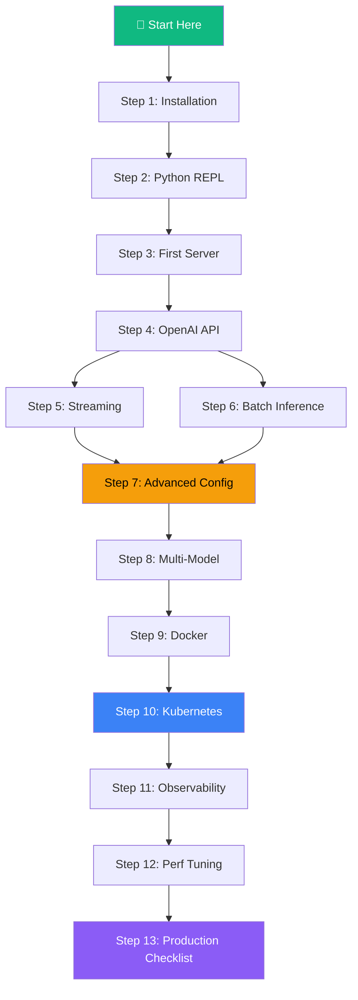
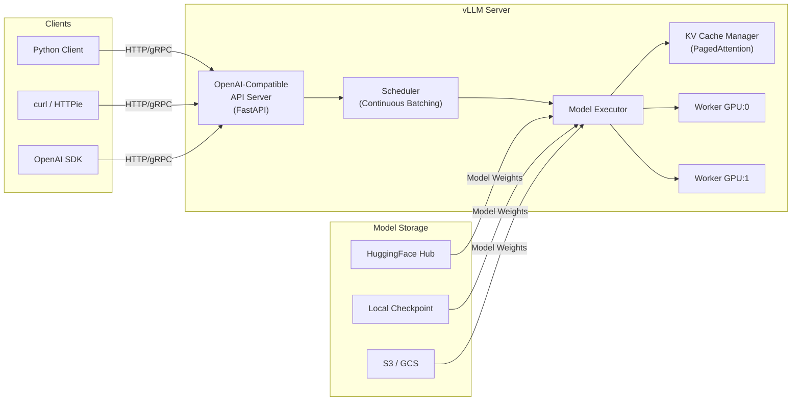
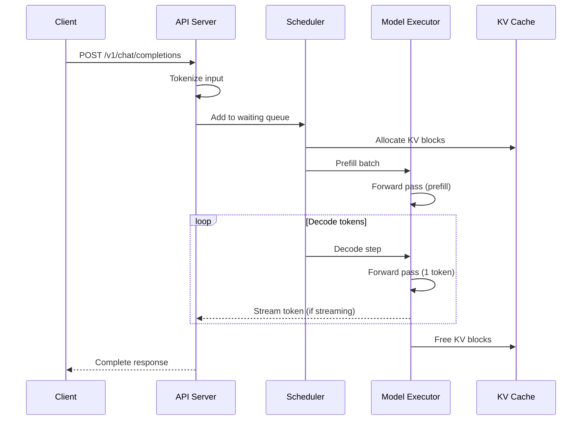
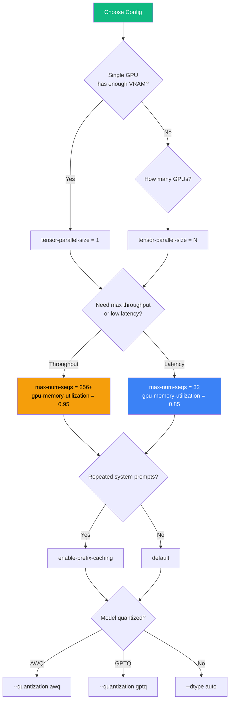
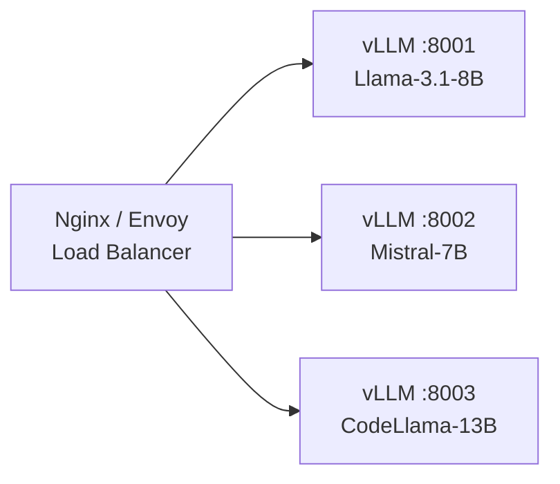
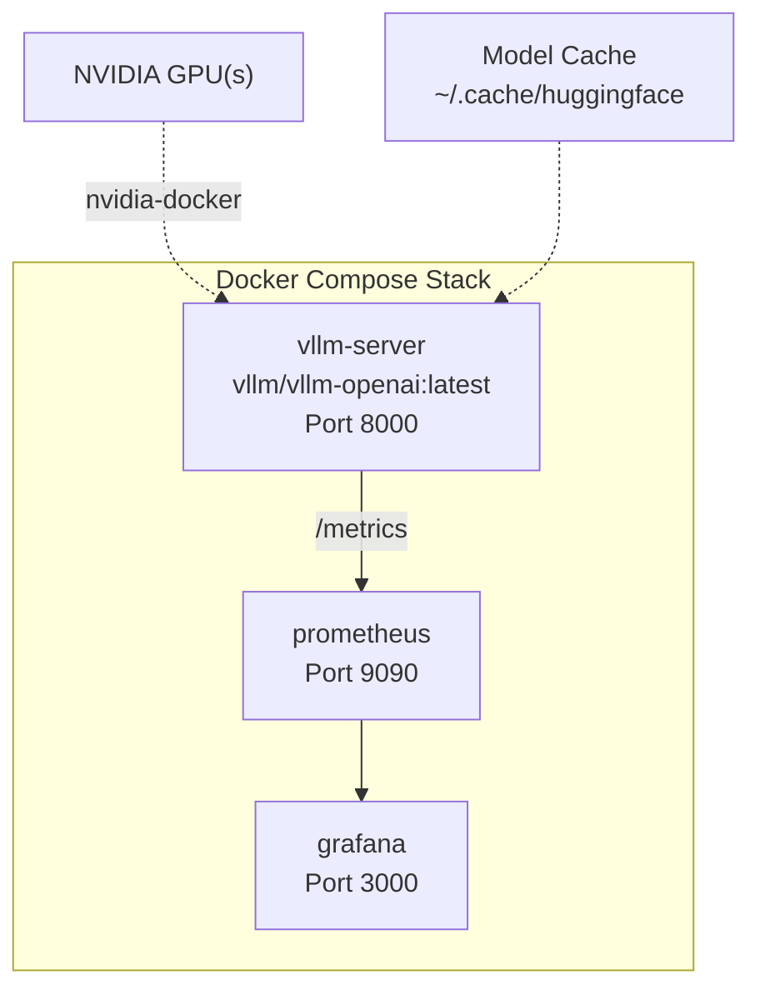
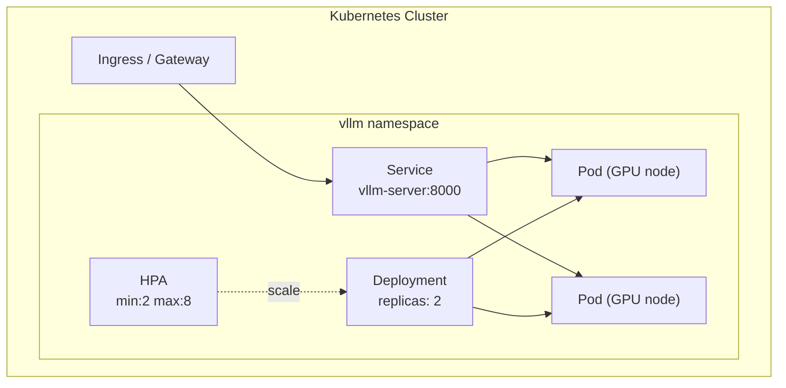
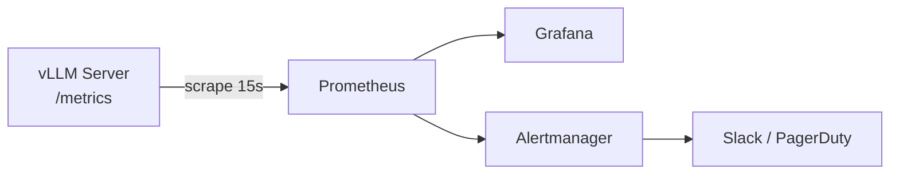
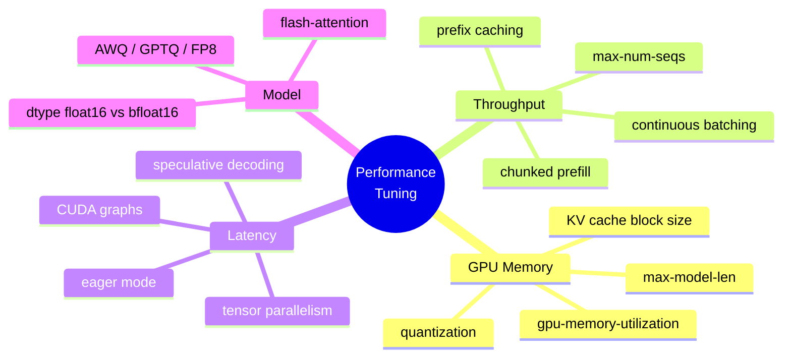
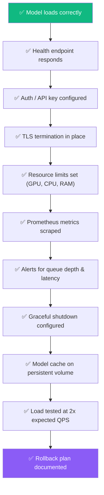

# vLLM Inference Server — Complete Tutorial

A hands-on, step-by-step guide to deploying and operating **vLLM** as a production-grade LLM inference server. Covers architecture, configuration, deployment patterns, observability, and performance tuning.

---

## Table of Contents

1. [Learning Path](#learning-path)
2. [Suggested Week-1 Plan](#suggested-week-1-plan)
3. [What is vLLM?](#what-is-vllm)
4. [Key Concepts](#key-concepts)
5. [Architecture Overview](#architecture-overview)
6. [Step 1 — Installation](#step-1--installation)
7. [Step 2 — Python REPL Quickstart](#step-2--python-repl-quickstart)
8. [Step 3 — Your First Inference Server](#step-3--your-first-inference-server)
9. [Step 4 — OpenAI-Compatible API](#step-4--openai-compatible-api)
10. [Step 5 — Streaming Responses](#step-5--streaming-responses)
11. [Step 6 — Batch Inference](#step-6--batch-inference)
12. [Step 7 — Advanced Serving Configuration](#step-7--advanced-serving-configuration)
13. [Step 8 — Multi-Model Serving](#step-8--multi-model-serving)
14. [Step 9 — Docker Deployment](#step-9--docker-deployment)
15. [Step 10 — Kubernetes Deployment](#step-10--kubernetes-deployment)
16. [Step 11 — Observability & Monitoring](#step-11--observability--monitoring)
17. [Step 12 — Performance Tuning & Benchmarking](#step-12--performance-tuning--benchmarking)
18. [Step 13 — Production Checklist](#step-13--production-checklist)
19. [Quick Reference](#quick-reference)
20. [Project Structure](#project-structure)
21. [Further Reading](#further-reading)

---

## Learning Path



---

## Suggested Week-1 Plan

An opinionated day-by-day plan to get productive with vLLM fast:

| Day | Focus | What to Do |
|---|---|---|
| **Day 1** | Run it locally in Python | Install vLLM, load Qwen 0.5B–1.5B, call `llm.generate` on a batch. Tweak `max_tokens`, `temperature`, `top_p` and observe output/latency changes. |
| **Day 2** | Start the HTTP server | Launch `vllm serve` or `python -m vllm.entrypoints.openai.api_server`. Hit `/v1/chat/completions` with curl and with the OpenAI Python SDK (just change `base_url`). |
| **Day 3–4** | Swap models & tune | Try different HF models (Qwen, Llama, Mistral). Experiment with `--max-num-batched-tokens`, `--dtype`, context length. Watch GPU memory/throughput impact. |
| **Day 5–7** | Internals & infra | Read the PagedAttention design docs. Skim the [architecture deep-dive](docs/architecture.md). Plan how to integrate into your infra (K8s, autoscaling, monitoring). |

---

## What is vLLM?

**vLLM** is a high-throughput, memory-efficient inference and serving engine for Large Language Models. It implements **PagedAttention** — a technique that manages KV-cache memory like OS virtual memory pages — enabling:

- **Up to 24x higher throughput** vs. HuggingFace Transformers
- **Near-zero memory waste** through non-contiguous KV-cache allocation
- **Continuous batching** — new requests join a running batch without waiting
- **OpenAI-compatible API** — drop-in replacement for existing OpenAI clients
- **Tensor parallelism** — serve models across multiple GPUs
- **Quantization support** — AWQ, GPTQ, FP8, INT8 out of the box

### How vLLM Compares

| Feature | vLLM | SGLang | TGI | TensorRT-LLM |
|---|---|---|---|---|
| PagedAttention | ✅ | ✅ (RadixAttention) | ❌ | ✅ (optimized) |
| Continuous Batching | ✅ | ✅ | ✅ | ✅ (in-flight batching) |
| OpenAI API | ✅ | ✅ | ❌ (different) | ❌ (custom via Triton) |
| Multi-GPU (TP) | ✅ | ✅ | ✅ | ✅ |
| Hardware Support | NVIDIA/AMD/Intel | NVIDIA/AMD | NVIDIA | NVIDIA only |
| Quantization | AWQ/GPTQ/FP8 | AWQ/GPTQ/FP8 | GPTQ/AWQ | FP8/INT8/INT4/FP16 |
| MoE Optimization | ❌ | ✅ | ❌ | ✅ |
| Structured Output | Basic | ✅ (native) | ❌ | ❌ |
| Function Calling | Basic | ✅ (optimized) | ❌ | ❌ |
| Peak Performance | 600-700 tok/s | 500-600 tok/s | 400-500 tok/s | Up to 2.5× faster |
| Model Compatibility | Broad (HuggingFace) | Broad (HuggingFace) | Limited | Requires conversion |
| Ease of Setup | ⭐⭐⭐⭐⭐ | ⭐⭐⭐⭐⭐ | ⭐⭐⭐⭐ | ⭐⭐ |

**When to use vLLM:**
- Simple, large-scale deployments with dense models (LLaMA, Mistral, Gemma family)
- Need production reliability and flexibility across hardware (NVIDIA/AMD/Intel)
- Want easy setup with broad HuggingFace model support
- Standard OpenAI-compatible API is sufficient

**When to use SGLang:**
- Mixture of Expert models (Qwen, DeepSeek, Mixtral)
- Complex LLM programs requiring function calling, JSON parsing, or constraint generation
- Need fullstack runtime for sophisticated agent workflows

**When to use TensorRT-LLM:**
- Maximum raw speed on NVIDIA GPUs (up to 2.5× faster than vLLM)
- Large stable production deployments where performance optimization is critical
- Have resources for model conversion and tuning
- Can commit to NVIDIA-only infrastructure for peak efficiency

---

## Key Concepts

Before diving into code, internalize these three ideas — they explain _why_ vLLM is fast:

**PagedAttention & KV Blocks** — The KV cache for each sequence is partitioned into fixed-size blocks ("pages"). Each request maintains a block table mapping logical blocks to physical GPU memory locations. This lets the engine allocate, evict, and pin blocks flexibly without the fragmentation penalty of contiguous allocation, while preserving standard attention math.

**Block Space Manager / Scheduler** — Given GPU memory budget, max tokens, and current traffic, the scheduler decides how many tokens to generate per request per step and which KV blocks to allocate or evict. It implements continuous batching: new requests are admitted to the running batch on every decode step, and finished requests release their blocks immediately.

**Online vs Offline Modes** — vLLM operates in two patterns:
- **Offline batched inference** — Hand it a list of prompts via `llm.generate()` and it maximizes throughput with no server overhead. Best for evaluation, data labeling, bulk generation.
- **Online serving** — OpenAI-compatible HTTP server handles streaming traffic with backpressure, continuous batching, and concurrent request management.

---

## Architecture Overview

> Detailed architecture doc: [`docs/architecture.md`](docs/architecture.md)



### Request Lifecycle



---

## Step 1 — Installation

### Prerequisites

| Requirement | Minimum | Recommended |
|---|---|---|
| Python | 3.9 | 3.11+ |
| CUDA | 11.8 | 12.1+ |
| GPU VRAM | 16 GB | 24+ GB |
| RAM | 32 GB | 64+ GB |

### Option A: pip (quickest)

```shell
pip install vllm
```

### Option B: From source (latest features)

```shell
git clone https://github.com/vllm-project/vllm.git
cd vllm
pip install -e .
```

### Option C: Docker (recommended for production)

```shell
docker pull vllm/vllm-openai:latest
```

### Option D: Using this project (uv + Make)

```bash
git clone <this-repo>
cd vLLM
make build    # installs uv (if needed) + all dependencies into .venv
```

### Verify installation

```shell
python -c "import vllm; print(vllm.__version__)"
```

### Makefile Targets

This project ships a `Makefile` that wraps common workflows. Run `make help` for the full list:

```
  build               Install uv + project dependencies
  serve               Start vLLM server with MODEL (default: Qwen 1.5B)
  serve-advanced      Start vLLM with production config
  repl                Run the Python REPL quickstart (offline batch inference)
  chat                Run the chat completion example (server must be running)
  stream              Run the streaming example (server must be running)
  lora                Run the LoRA multi-model example (server must be running)
  lint                Run ruff linter on example scripts
  format_check        Check code formatting (non-destructive)
  format_fix          Auto-format and fix lint issues
  check_all           Run all quality checks
  benchmark           Run benchmark suite (server must be running)
  docker-up           Start full stack (vLLM + Prometheus + Grafana)
  docker-down         Stop full stack
  docker-logs         Tail vLLM server logs
  clean               Remove virtualenv, caches, and build artifacts
```

**Common workflows:**

```bash
# Quickstart: build + serve in one go
make serve

# Serve a different model
make serve MODEL=mistralai/Mistral-7B-Instruct-v0.3 PORT=8080

# Run examples against a running server
make chat
make stream

# Full Docker stack (vLLM + Prometheus + Grafana)
make docker-up
make docker-logs
make docker-down

# Code quality
make check_all
make format_fix
```

---

## Step 2 — Python REPL Quickstart

Before spinning up a server, try vLLM directly in Python. Use a **lightweight model** (Qwen 0.5B–1.5B) so it loads fast and runs on modest hardware:

```python
from vllm import LLM, SamplingParams

# Qwen 0.5B fits in ~2GB VRAM — perfect for experimentation
llm = LLM("Qwen/Qwen2.5-0.5B-Instruct")
sampling_params = SamplingParams(temperature=0.7, max_tokens=64)

outputs = llm.generate(
    ["Explain what vLLM is in one sentence.",
     "Give me a Python hello-world example."],
    sampling_params
)

for out in outputs:
    print("PROMPT:", out.prompt)
    print("GEN:", out.outputs[0].text, "\n")
```

**Mental model for the Python API:**

| Object | Role |
|---|---|
| `LLM(model)` | Loads a HuggingFace model into vLLM's engine with PagedAttention |
| `SamplingParams` | Controls decoding: `temperature`, `top_p`, `max_tokens`, stop sequences |
| `llm.generate(prompts, params)` | Batched generation — passing a list of prompts is how vLLM achieves high throughput |

This is the **offline batched inference** mode — no HTTP server, maximum throughput, ideal for experimentation and bulk workloads.

---

## Step 3 — Your First Inference Server

Start a server with a small model to verify everything works:

```shell
# Option A: Lightweight model (fits on ~4GB VRAM)
vllm serve Qwen/Qwen2.5-1.5B-Instruct --host 0.0.0.0 --port 8000

# Option B: Mistral-7B-Instruct (needs 24GB GPU)
vllm serve mistralai/Mistral-7B-Instruct-v0.3 --host 0.0.0.0 --port 8000
```

You can also use the explicit module entrypoint for more control:

```shell
python -m vllm.entrypoints.openai.api_server \
  --model Qwen/Qwen2.5-1.5B-Instruct \
  --dtype float16 \
  --max-num-batched-tokens 32768
```

Test it:

```shell
curl -s http://localhost:8000/v1/completions \
  -H "Content-Type: application/json" \
  -d '{
    "model": "Qwen/Qwen2.5-1.5B-Instruct",
    "prompt": "The capital of France is",
    "max_tokens": 32,
    "temperature": 0.0
  }' | python -m json.tool
```

This starts an HTTP server exposing routes: `/v1/chat/completions`, `/v1/completions`, `/v1/embeddings`, `/v1/models`, and `/health`.

> **Config file version:** see [`configs/basic-serve.yaml`](configs/basic-serve.yaml)

---

## Step 4 — OpenAI-Compatible API

vLLM exposes an **OpenAI-compatible** REST API. Any code using the OpenAI Python SDK works with zero changes — just point `base_url` at your vLLM server.

### Supported Endpoints

| Endpoint | Description |
|---|---|
| `GET /v1/models` | List loaded models |
| `POST /v1/completions` | Text completion |
| `POST /v1/chat/completions` | Chat completion |
| `POST /v1/embeddings` | Embeddings (if model supports) |

### Python client example

```python
from openai import OpenAI

client = OpenAI(
    base_url="http://localhost:8000/v1",
    api_key="not-needed",  # vLLM doesn't require a key by default
)

response = client.chat.completions.create(
    model="mistralai/Mistral-7B-Instruct-v0.3",
    messages=[
        {"role": "system", "content": "You are a helpful assistant."},
        {"role": "user", "content": "Explain PagedAttention in 3 sentences."},
    ],
    temperature=0.7,
    max_tokens=256,
)

print(response.choices[0].message.content)
```

> Full example: [`examples/python-clients/chat_completion.py`](examples/python-clients/chat_completion.py)

---

## Step 5 — Streaming Responses

Streaming drastically reduces time-to-first-token (TTFT) perceived by users.

```python
from openai import OpenAI

client = OpenAI(base_url="http://localhost:8000/v1", api_key="na")

stream = client.chat.completions.create(
    model="mistralai/Mistral-7B-Instruct-v0.3",
    messages=[{"role": "user", "content": "Write a haiku about GPUs."}],
    stream=True,
)

for chunk in stream:
    delta = chunk.choices[0].delta.content
    if delta:
        print(delta, end="", flush=True)
print()
```

> Full example: [`examples/streaming/stream_chat.py`](examples/streaming/stream_chat.py)

---

## Step 6 — Batch Inference

For offline workloads (evaluation, data labeling, bulk generation), use vLLM's Python engine directly — no server needed.

```python
from vllm import LLM, SamplingParams

llm = LLM(model="mistralai/Mistral-7B-Instruct-v0.3")
params = SamplingParams(temperature=0.0, max_tokens=128)

prompts = [
    "Summarize the theory of relativity:",
    "Translate to French: 'Hello, how are you?'",
    "Write a SQL query to find duplicate rows:",
]

outputs = llm.generate(prompts, params)

for output in outputs:
    print(f"Prompt: {output.prompt[:50]}...")
    print(f"Output: {output.outputs[0].text}\n")
```

> Full example: [`examples/batch-inference/batch_generate.py`](examples/batch-inference/batch_generate.py)

---

## Step 7 — Advanced Serving Configuration

> Config file: [`configs/advanced-serve.yaml`](configs/advanced-serve.yaml)

### Key Parameters

```shell
vllm serve meta-llama/Meta-Llama-3.1-8B-Instruct \
    --host 0.0.0.0 \
    --port 8000 \
    --tensor-parallel-size 2 \          # split across 2 GPUs
    --max-model-len 8192 \              # max context window
    --gpu-memory-utilization 0.90 \     # use 90% of GPU VRAM for KV cache
    --max-num-seqs 256 \                # max concurrent sequences
    --enable-prefix-caching \           # reuse KV cache for shared prefixes
    --quantization awq \                # serve AWQ-quantized model
    --dtype float16 \
    --enforce-eager                     # disable CUDA graphs (debug)
```

### Parameter Decision Tree



---

## Step 8 — Multi-Model Serving

vLLM supports serving multiple models on a single server using `--served-model-name` or via the LoRA adapter mechanism.

### Strategy A: Multiple vLLM processes behind a load balancer



> Config: [`configs/nginx-multi-model.conf`](configs/nginx-multi-model.conf)

### Strategy B: LoRA adapters on a single base model

```shell
vllm serve meta-llama/Meta-Llama-3.1-8B-Instruct \
    --enable-lora \
    --lora-modules \
        sql-expert=./lora-adapters/sql-expert \
        summarizer=./lora-adapters/summarizer \
    --max-loras 4 \
    --max-lora-rank 64
```

> Full example: [`examples/multi-model/lora_serving.py`](examples/multi-model/lora_serving.py)

---

## Step 9 — Docker Deployment

> Dockerfile: [`docker/Dockerfile`](docker/Dockerfile)
> Compose: [`docker/docker-compose.yaml`](docker/docker-compose.yaml)

```shell
cd docker
docker compose up -d
```

### Docker Architecture



---

## Step 10 — Kubernetes Deployment

> Manifests: [`k8s/`](k8s/)

```shell
kubectl apply -f k8s/namespace.yaml
kubectl apply -f k8s/deployment.yaml
kubectl apply -f k8s/service.yaml
kubectl apply -f k8s/hpa.yaml
```

### K8s Architecture



---

## Step 11 — Observability & Monitoring

vLLM exposes Prometheus metrics at `/metrics`.

### Key Metrics

| Metric | What It Tells You |
|---|---|
| `vllm:num_requests_running` | Current in-flight requests |
| `vllm:num_requests_waiting` | Queued requests (backpressure signal) |
| `vllm:gpu_cache_usage_perc` | KV cache utilization (key scaling metric) |
| `vllm:avg_generation_throughput_toks_per_s` | Token throughput |
| `vllm:e2e_request_latency_seconds` | End-to-end latency histogram |
| `vllm:time_to_first_token_seconds` | TTFT histogram |

> Grafana dashboard: [`observability/grafana/vllm-dashboard.json`](observability/grafana/vllm-dashboard.json)
> Prometheus config: [`observability/prometheus/prometheus.yml`](observability/prometheus/prometheus.yml)

### Metrics Flow



---

## Step 12 — Performance Tuning & Benchmarking

### Benchmarking

```shell
# vLLM ships a benchmarking tool
python -m vllm.entrypoints.openai.api_server &  # start server first

python -m vllm benchmark serve \
    --model mistralai/Mistral-7B-Instruct-v0.3 \
    --dataset-name sharegpt \
    --num-prompts 1000 \
    --request-rate 10
```

> Benchmark script: [`scripts/benchmark.sh`](scripts/benchmark.sh)

### Tuning Levers



### Quick Tuning Cheat Sheet

| Goal | Lever | Value |
|---|---|---|
| Max throughput | `--max-num-seqs` | 256+ |
| Lower TTFT | `--enable-chunked-prefill` | enabled |
| Save VRAM | `--quantization awq` | AWQ model |
| Shared prefixes | `--enable-prefix-caching` | enabled |
| Multi-GPU | `--tensor-parallel-size` | # GPUs |
| Speculative decode | `--speculative-model` | draft model path |

---

## Step 13 — Production Checklist



### Security

- Set `--api-key` to require bearer tokens
- Terminate TLS at Ingress/LB level
- Run container as non-root
- Network-policy restrict `/metrics` to monitoring namespace

### Reliability

- Set `readinessProbe` on `/health`
- Use `preStop` hook with `sleep 15` for graceful drain
- PodDisruptionBudget `minAvailable: 1`
- Anti-affinity across GPU nodes

---

## Quick Reference

| Topic | What to Learn First | Where to Go Deeper |
|---|---|---|
| Basic Python usage | `LLM`, `SamplingParams`, `llm.generate` with batches | [Official quickstart](https://docs.vllm.ai/en/latest/getting_started/quickstart/) |
| HTTP serving | `vllm serve` / `api_server` with OpenAI endpoints | [OpenAI-compatible server docs](https://docs.vllm.ai/en/stable/serving/openai_compatible_server/) |
| Performance concepts | PagedAttention, KV blocks, block table | [PagedAttention design doc](https://docs.vllm.ai/en/latest/design/paged_attention/) + [explainer blog](https://hamzaelshafie.bearblog.dev/paged-attention-from-first-principles-a-view-inside-vllm/) |
| Production deployment | CLI flags, max tokens, dtype, monitoring | [Deployment guide (Ploomber)](https://ploomber.io/blog/vllm-deploy/) |
| Project / code reference | Source layout, issues, examples | [vLLM GitHub](https://github.com/vllm-project/vllm) |

---

## Project Structure

```
vLLM/
├── README.md                          ← You are here
├── Makefile                           ← Build, serve, lint, docker, benchmark
├── pyproject.toml                     ← Project config (uv / pip)
├── .gitignore
├── docs/
│   └── architecture.md                ← Deep-dive architecture + diagrams
├── configs/
│   ├── basic-serve.yaml               ← Minimal serving config
│   ├── advanced-serve.yaml            ← Production serving config
│   └── nginx-multi-model.conf         ← Multi-model LB config
├── examples/
│   ├── python-clients/
│   │   └── chat_completion.py         ← OpenAI SDK client
│   ├── streaming/
│   │   └── stream_chat.py             ← Streaming example
│   ├── batch-inference/
│   │   └── batch_generate.py          ← Offline batch generation
│   └── multi-model/
│       └── lora_serving.py            ← LoRA multi-adapter serving
├── docker/
│   ├── Dockerfile                     ← Production Dockerfile
│   └── docker-compose.yaml            ← Full stack (vLLM + Prom + Grafana)
├── k8s/
│   ├── namespace.yaml
│   ├── deployment.yaml
│   ├── service.yaml
│   └── hpa.yaml
├── observability/
│   ├── prometheus/
│   │   └── prometheus.yml
│   └── grafana/
│       └── vllm-dashboard.json
└── scripts/
    └── benchmark.sh                   ← Benchmarking script
```

---

## Further Reading

**Official Resources:**
- [vLLM Documentation](https://docs.vllm.ai/)
- [vLLM GitHub](https://github.com/vllm-project/vllm)
- [vLLM Quickstart](https://docs.vllm.ai/en/latest/getting_started/quickstart/)
- [OpenAI-Compatible Server Docs](https://docs.vllm.ai/en/stable/serving/openai_compatible_server/)
- [PagedAttention Design Doc](https://docs.vllm.ai/en/latest/design/paged_attention/)

**Papers & Deep Dives:**
- [PagedAttention Paper (arXiv)](https://arxiv.org/abs/2309.06180)
- [Paged Attention from First Principles — A View Inside vLLM](https://hamzaelshafie.bearblog.dev/paged-attention-from-first-principles-a-view-inside-vllm/)
- [PagedAttention — MLOps Dictionary (Hopsworks)](https://www.hopsworks.ai/dictionary/pagedattention)
- [Continuous Batching Explained (Anyscale)](https://www.anyscale.com/blog/continuous-batching-llm-inference)

**Deployment & Tutorials:**
- [Deploying vLLM: A Step-by-Step Guide (Ploomber)](https://ploomber.io/blog/vllm-deploy/)
- [vLLM Quickstart: High-Performance LLM Serving (Glukhov)](https://www.glukhov.org/llm-hosting/vllm/vllm-quickstart/)
- [Run an OpenAI-Compatible Server (Arm Learning Paths)](https://learn.arm.com/learning-paths/servers-and-cloud-computing/vllm/vllm-server/)
- [OpenAI API Reference](https://platform.openai.com/docs/api-reference)
