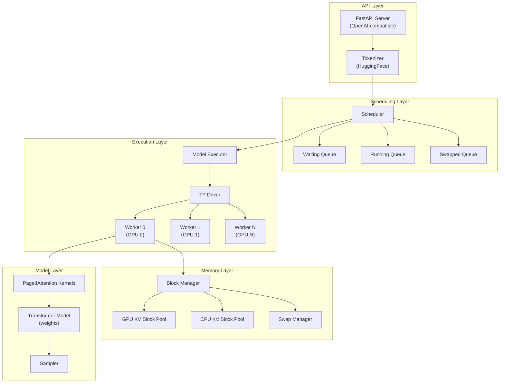
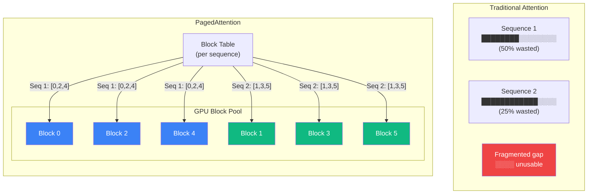
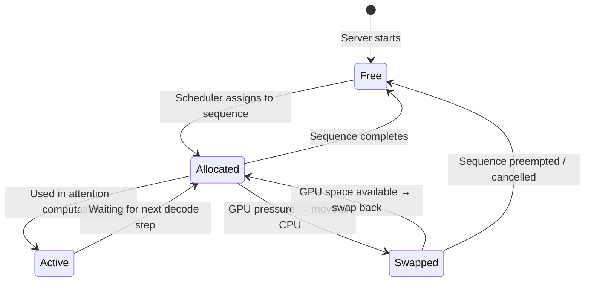
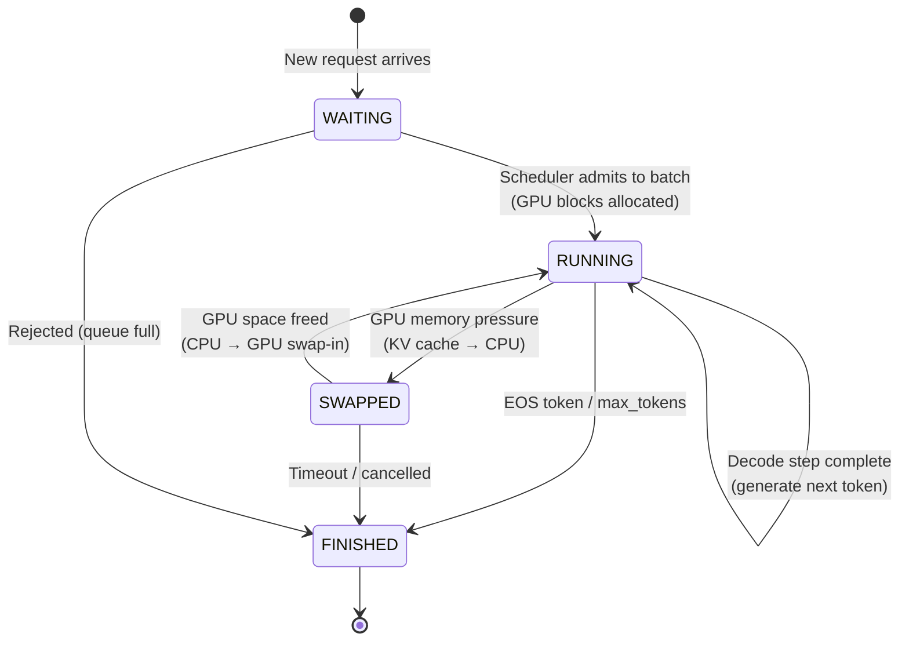
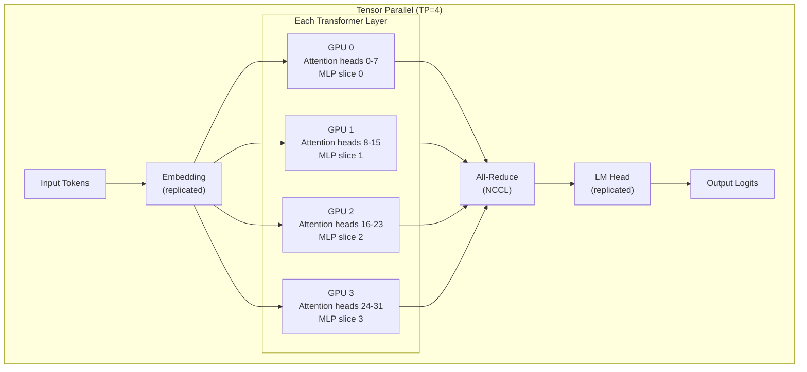
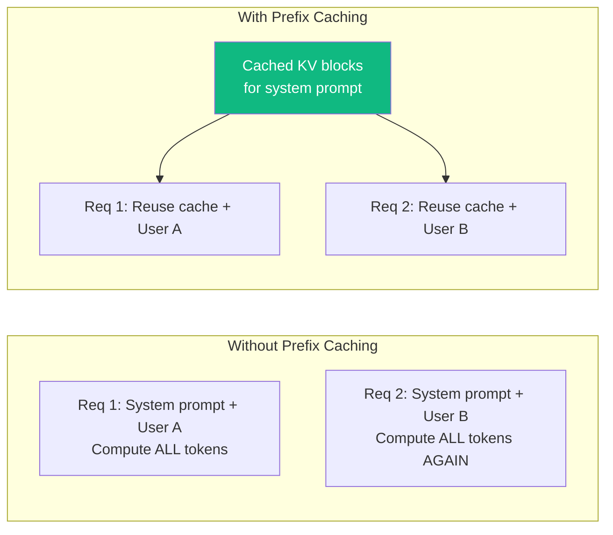
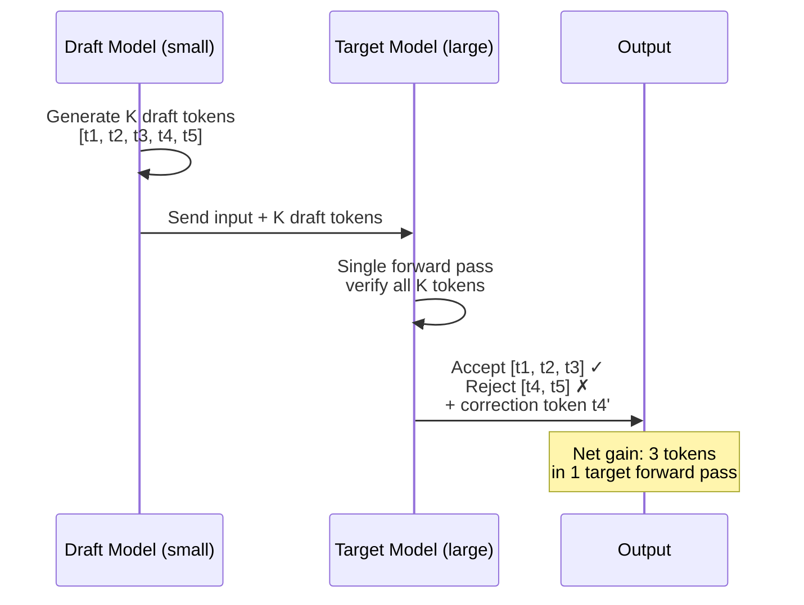
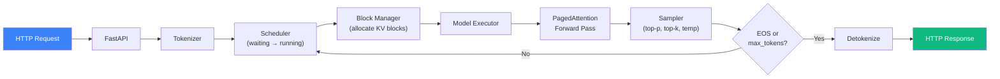

# vLLM Architecture Deep Dive

This document covers the internals of vLLM — how requests flow through the system, how PagedAttention manages memory, and how continuous batching maximizes GPU utilization.

---

## High-Level Architecture



---

## PagedAttention — The Core Innovation

Traditional attention mechanisms allocate a **contiguous** block of GPU memory for the entire KV cache of each sequence. This leads to:

- **Internal fragmentation** — allocated but unused memory within a sequence's block
- **External fragmentation** — small gaps between allocations that can't be used
- **Reservation waste** — pre-allocating for `max_seq_len` even if the sequence is short

### How PagedAttention Fixes This

PagedAttention borrows the concept of **virtual memory paging** from operating systems:



### Memory Lifecycle



Key properties:
- Blocks are a fixed size (default: 16 tokens)
- Blocks are **non-contiguous** — a sequence's KV cache can be scattered across GPU memory
- **Block table** (like a page table) maps logical blocks → physical blocks
- **Copy-on-write** for beam search / parallel sampling — shared prefixes share physical blocks

---

## Continuous Batching

Traditional (static) batching waits for all sequences in a batch to finish before admitting new ones. This wastes GPU compute while short sequences wait for long ones.

### Static vs Continuous Batching

```mermaid
gantt
    title Static Batching (Wasteful)
    dateFormat X
    axisFormat %s

    section Batch 1
    Seq A (short)  : 0, 3
    Seq B (long)   : 0, 8
    GPU idle (A done, waiting for B) : 3, 8

    section Batch 2
    Seq C : 8, 12
    Seq D : 8, 14
```

```mermaid
gantt
    title Continuous Batching (vLLM)
    dateFormat X
    axisFormat %s

    section GPU Always Busy
    Seq A        : 0, 3
    Seq C (fills A's slot) : 3, 7
    Seq B        : 0, 8
    Seq D (fills B's slot) : 8, 12
    Seq E (fills C's slot) : 7, 11
```





### Scheduler State Machine



### Scheduling Policy

vLLM's scheduler runs on every decode step:

1. **Try to swap in** — bring back swapped sequences if GPU blocks available
2. **Try to schedule waiting** — admit new sequences from the waiting queue
3. **Preempt if needed** — if neither works, swap out the lowest-priority running sequence

Priority is determined by arrival time (FCFS) by default, but can be customized.

---

## Tensor Parallelism

For models too large for a single GPU, vLLM splits the model across GPUs using **tensor parallelism (TP)**.



### TP Sizing Guide

| Model Size | TP Size | GPU Type | Notes |
|---|---|---|---|
| 7B | 1 | A100 40GB / L40S | Fits on single GPU |
| 7B (quantized) | 1 | RTX 4090 24GB | AWQ/GPTQ |
| 13B | 1-2 | A100 80GB | 1 GPU if fp16 fits |
| 34B | 2 | A100 80GB | |
| 70B | 4 | A100 80GB | |
| 70B | 2 | H100 80GB | Higher bandwidth |
| 405B | 8 | H100 80GB | Full node |

---

## Prefix Caching

When many requests share the same system prompt (common in production), vLLM can **cache and reuse** the KV blocks for the shared prefix.



Enable with `--enable-prefix-caching`. Most impactful when:
- System prompts are long (RAG context, instructions)
- Many concurrent users share the same system prompt
- Multi-turn conversations (prior turns are the shared prefix)

---

## Speculative Decoding

Speculative decoding uses a small **draft model** to predict multiple tokens ahead, then the large **target model** verifies them in a single forward pass.



Enable with:
```shell
vllm serve large-model \
    --speculative-model small-draft-model \
    --num-speculative-tokens 5
```

---

## Summary: Data Flow End-to-End


